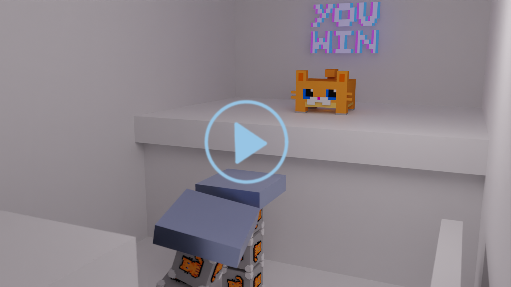

# Cat to the past

<a href="https://raw.githubusercontent.com/stefnotch/cgue23-cat-to-the-past/main/video-cat-to-the-past.mp4"></a>

Computergraphics Project at the TU Vienna

## Game concept

Rewinding time of the world around you, _but it doesn't affect your character._

So you can totally walk up to a table, and pick up the fancy sword.

Then rewind to the pastwhere the sword was still on the table. And since that didn't affect your character, you now have a sword on the table, _and a sword in your hand!_

Should make for an interesting puzzle game. Or a stealth:tm: game, because you can always openly smack the guy in front of you, get to the next area...and then just load the past where the guard was still alive and didn't alert the entire facility. Or that mechanic could be used to make a cat petting simulator, where you basically have a cheatcode. You can indefinitely pet the cat, because as soon as the cat is satisfied and walks away, you just turn time back... :cat2:

## Controls

- WASD+Mouse for moving
- Space to jump
- T for swiTching to freecam
  - WASD + Space to move around in the freecam mode
- Right mouse button for time rewinding
- Left mouse button for interacting
- Shift to speed up rewinding. Not actually needed to solve any levels.
- F8 enables/disables view frustum culling
- Esc to quit

## File structure

```text
assets/
    ...
    config.json - the configuration file, automatically gets created if missing
...
game.exe - the game executable
```

## Technical Details

world space: +y up, -z forward, +x right (reasonable right-handed coordinate system)
winding order: counter-clockwise
units: meter
importer: gltf, we flatten the tree, we generate one axis aligned collider per model

## Compiling and Running

You'll need a [Rust toolchain installed](https://www.rust-lang.org/tools/install). After that, you can start the game with

```
cargo run
```

To get a release build without manually copying files, you can use

```
npm build
```

(I really want Rust build scripts that don't run during development.)

## Demos

```
cargo run --bin bloom_demo
```

where bloom_demo can be replaced with the name of any demo project in the `demos/src/bin` folder

## Levels

A level internally has

- a numerical ID
- a camera: spawn position
- one shadow light
- ...

## Used sources

- Vulkano: https://github.com/vulkano-rs/vulkano/blob/master/vulkano-win/src/winit.rs#L17 and https://github.com/vulkano-rs/vulkano/tree/master/examples/src/bin/interactive_fractal and co
- Bloom:  https://learnopengl.com/Guest-Articles/2022/Phys.-Based-Bloom and https://github.com/Shot511/RapidGL/blob/65d1202a5926acad9816483b141fb24480e81668/src/demos/26_bloom/bloom.cpp
- PBR https://learnopengl.com/PBR/Lighting and https://www.youtube.com/watch?v=RRE-F57fbXw
- Projection matrices  https://johannesugb.github.io/gpu-programming/setting-up-a-proper-vulkan-projection-matrix/#perspective-projection-into-clip-space
- Player controller https://github.com/FlaxEngine/FlaxSamples/blob/master/FirstPersonShooterTemplate/Source/FirstPersonShooter/PlayerScript.cs
- Grid shader https://madebyevan.com/shaders/grid/ and https://www.shadertoy.com/view/MscSDf
- Game over pseudo-pixel-art https://www.123rf.com/photo_128791038_game-over-pixel-symbol.html
- Cat picture on the cubes https://www.redbubble.com/i/sticker/cat-pixel-art-by-MoDsama/82110572.EJUG5#&gid=1&pid=3
